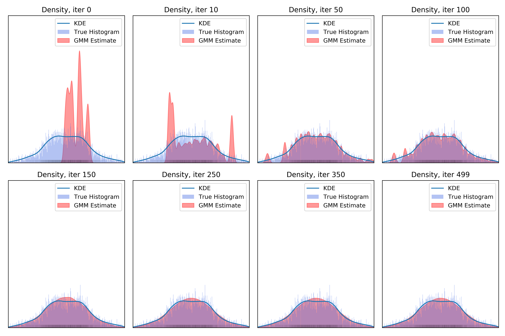
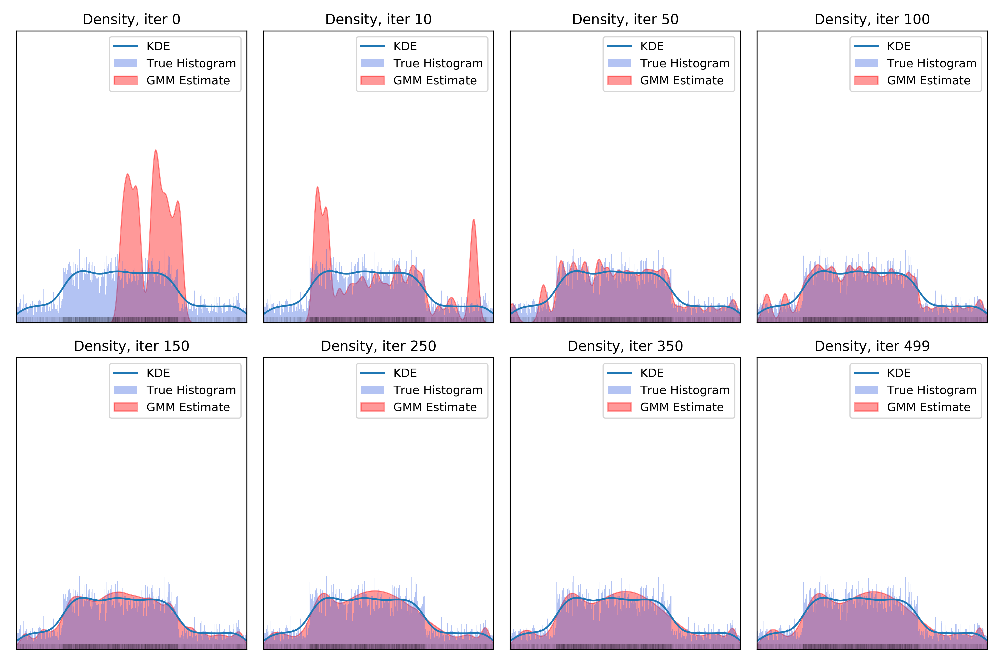

# Fitting Gaussian Mixture with variable number of classes

Here we adapt and follow the [code from PyKeOps](https://www.kernel-operations.io/keops/_auto_tutorials/gaussian_mixture/plot_gaussian_mixture.html#sphx-glr-auto-tutorials-gaussian-mixture-plot-gaussian-mixture-py)

## Two dimensional case
The initial example would fit 2d mixtures to jointly distributed data.

### Base example

We naturally reproduced the original example (which can be thought of as confounded data).
It can be found [in the pictures only repo](https://github.com/ArnoVel/causal-pictures/tree/master/fitting/gmm/dim-two),
as well as on the PyKeOps website.

### ANM example

What if we attempt to fit an ANM without a causal direction,
only using its joint distribution?

**Mixture of Uniforms as cause, spline mechanism:**  

**Uniform as cause, tanhSum mechanism:**

Additional examples can be found in the [in the pictures only repo](https://github.com/ArnoVel/causal-pictures/tree/master/fitting/gmm/dim-two)
or generated using `tests/test_gmm_fit` with anm data & the `dim=2` argument.

## One dimensional case

We adapt the code in order to fit 1D mixtures.
Our goal is to compute a reasonable approximation of the complexity of a distribution,
using the number of mixture components of a 'best' GMM approximation.
This either corresponds to the number of modes of the distribution, or roughly
to the complexity of the shape of the density.

### Two Triangles

### Two Uniforms

